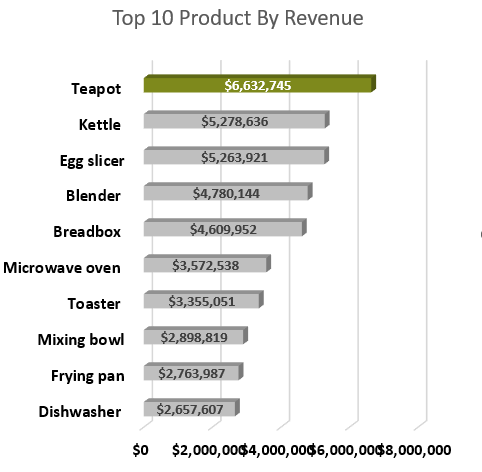
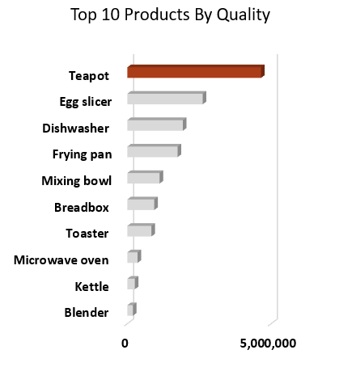
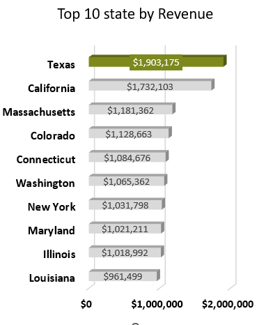
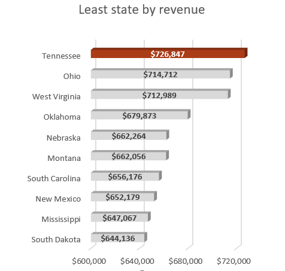
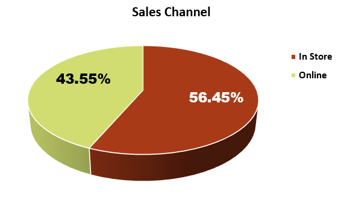

# Kitchen-Store-Sale-performance-Analysis-

Sales Performance Analysis provides several significant advantages to businesses and this includes identifying areas for improvement, tracking progress, as well as increasing revenue. As the Business Intelligent Analyst, I was directed by the founder of Kicthen Store, a fictitious manufacturing company to analyze the sales for 2022. She wants to keep an eye on her business' performace interally.

The company is a luxurous company that sells kicthen Equipment which includes Dishwater, Frying Pan, Toaster E.t.c.
I would be working with the founder using Excel to perform data exploration, uncover metrics and create an interactive dashboard tp would stories about the buisness 2022 sale perfomance.

The datasets has 2,615 rows and the following column attributes:
* Year - This includes 2019, 2020, 2021 and 2022 
* Products: The company sells 10 Kicthen Utensils which includes, Kettle, Blender, Dishwaher, Toaster, Breadbox, Frying pan, Egg slicer, Microwave oven, Mixing bowl and Teapot
* State - These are location orders came in from. There are 49 states in the data 
* Quality - The number of Items purchased 
* Revenue - The Money made from the Products
* Sale Channel - This is  means of Purchasing Products. It could be Online or In store

## Business Problem

* To summary the sales of each of the products for 2022 only.
* what are the 10 most and less products by revenue and quality?
* What are the 10 most and less state By Revenue per and Quality ?
* which sales channel do customers use the most? Online or In store

## The processes I took in other to provide answers to the above questions are:
* Cleaned the data using Power Query
* Created reports On each of the products sold by the company using Excel Formulars such as Sumifs, If clause, Index and match  and also analysed the data using pivot table 
* Visualized my reports via charts.
* Designed my dashboard with the reports and most important metrics.

# Exploratory Data Analysis.

## Excel Interactive Dashboard Created for the Analysis

### Business Problem 1 :  Summary the sales of each of the products for 2022 only.

## Kindly Click on issues to have an Idea on how each of the products  were analysed and visualized.

## Business Problem 2 - what is the  most and least product by revenue and quality?

According to my analysis, The best selling Kitchen Utensil is Teapot as it generated ($6,632,745) a total Percentage of 15.89, while the least selling product is Dishwasher whuch generated a sum of ($2,657,607), a total percentage of 6.36%. 

Product By Quality Analysis - The product with the most Orders is Teapot, The company sold about 4,651,820 with a total percentage of 31.72%. The least ordered product is Blender, About 195,973 a total percentage of 1.34%. However Blender performed very well as it generated about $4,780,144 with a total percentage of 11.43%. It is part of the top 5 product by revenue .

## Business Problem 3- What are the 10 most and least state By Revenue per and Quality ?

           

The total revenue generated in 2022 is $41,813,400, Texas has the highest amount generated By $1,903,175 with a total percentage of 4.55%, followed by Califonia, which made eaxcatly $1,732,103 and a percantage rate of 4.14%. On the other hand, the state that generated the least revneue is Tennessee, had excatly $726,847, a total of 1.74%.

## Business Problem 4 - which sales channel do customers use the most? Online or In store?

Based on the Analysis, Customers use the In store sales customers more than they use online. Out of the $41,813,400 generated in 2022, $23,601,941 came from In store sales Channel, a percentage of 56.45%. WHile the company made $18,211,459 from the online sales Channel, a total rate of 43.55%. Lower than in store sales channel by 5.5 Million dollars.

## Recommedation 

